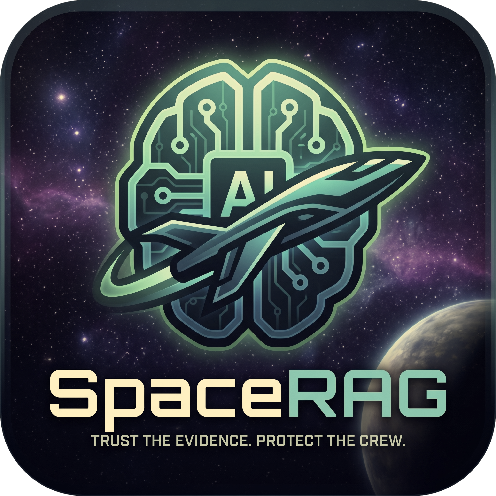
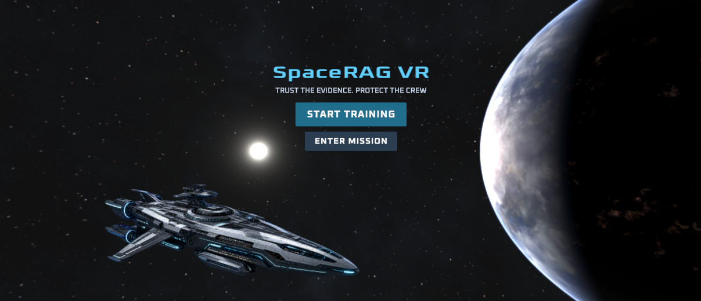
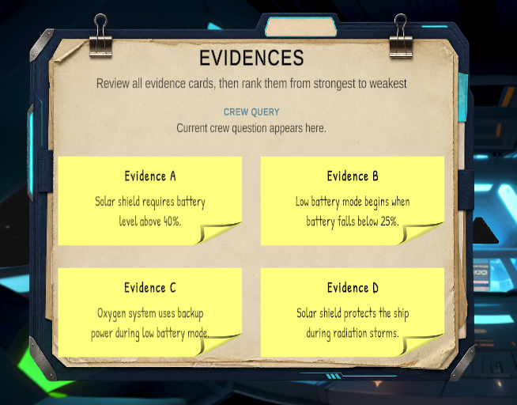
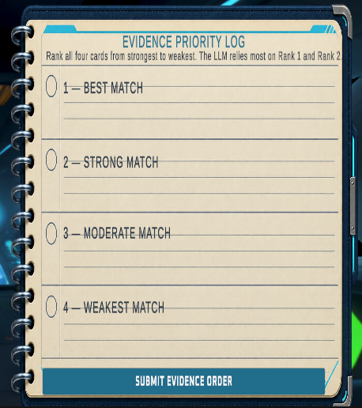
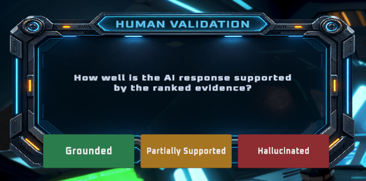
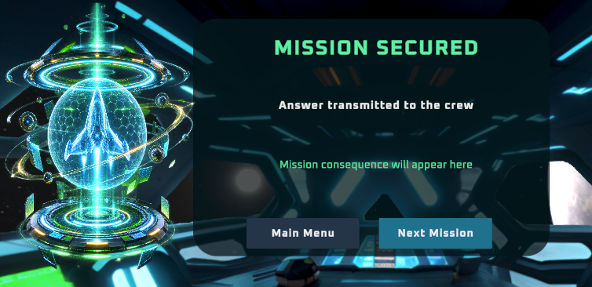
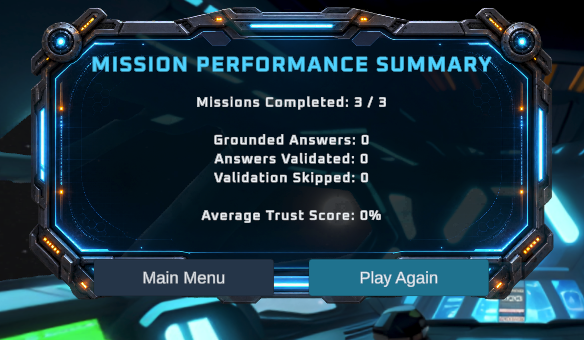

<div align="center">

<!-- ICON PLACEHOLDER
     Add your game icon at: docs/images/spacerag-vr-icon.png
     Recommended format: square PNG with a transparent background. -->


# SpaceRAG VR

### Learn to build trustworthy AI answers—before the mission depends on them.

[](https://unity.com/)
[](https://www.meta.com/quest/quest-3s/)
[](https://www.khronos.org/openxr/)
[](https://learn.microsoft.com/dotnet/csharp/)

[Download the latest APK](https://github.com/sum1tbarua/SpaceRAG-VR/releases) · [Report an issue](https://github.com/sum1tbarua/SpaceRAG-VR/issues)

</div>

---

## Mission Overview

**SpaceRAG VR** is an educational virtual-reality game that introduces Retrieval-Augmented Generation (RAG) through a safety-critical space-mission scenario. The player serves as an **AI Mission Officer**, helping a spacecraft crew answer operational questions using trusted evidence.

The challenge is not simply to generate an answer. Players must inspect evidence, rank sources, evaluate the resulting AI response, and decide whether it is sufficiently grounded to support a mission decision. Good judgment protects the crew; weak evidence or skipped validation can lead to delayed decisions, system failures, or mission-ending consequences.

> In high-stakes environments, a confident answer is not enough—the answer must be supported by trustworthy evidence.

## Gameplay Gallery

<!-- SCREENSHOT PLACEHOLDERS
     Create the docs/images folder and replace these files with your screenshots.
     Recommended size: 1600 × 900 PNG or JPG using the same aspect ratio. -->

| Mission selection | Evidence investigation |
|:---:|:---:|
|  |  |
| *Choose a mission and begin AI training.* | *Inspect evidence before trusting the generated answer.* |

| Evidence reranking | AI answer validation |
|:---:|:---:|
|  |  |
| *Prioritize the strongest sources for generation.* | *Classify the response as grounded, partial, or risky.* |

| Mission outcome | Performance debrief |
|:---:|:---:|
|  |  |
| *See the operational consequence of the decision.* | *Review trust score and session performance.* |

## Core Gameplay Loop

1. **Receive a crew query** related to the current spacecraft mission.
2. **Inspect four evidence cards** containing relevant and distracting information.
3. **Rerank the evidence** according to usefulness and trustworthiness.
4. **Submit the evidence order** to the simulated AI assistant.
5. **Review the generated answer** and its supporting references.
6. **Validate the response** as grounded, partially grounded, or risky.
7. **Experience the consequence** through a mission-specific holographic outcome.
8. **Complete three missions** and receive a final trust-performance debrief.

## Key Features

- Immersive space-command-center environment designed for VR
- Interactive evidence-card inspection and drag-and-drop reranking
- Simulated RAG answer generation based on the selected evidence order
- Grounded, partially grounded, and risky answer states
- Player-controlled validation before an answer reaches the crew
- Trust scoring based on retrieval quality and validation behavior
- Distinct cyan, amber, and red holographic mission outcomes
- Operational consequences that explain why trustworthy AI matters
- Three randomized missions per gameplay session
- Animated final mission-performance summary
- Standalone deployment and testing on Meta Quest 3S

## Learning Objectives

By completing the game, players should be able to:

- Explain why retrieval quality affects AI answer reliability.
- Distinguish relevant evidence from plausible but distracting information.
- Understand why evidence ranking matters in a RAG workflow.
- Recognize grounded, incomplete, and unsupported AI responses.
- Explain how validation can prevent unsafe automated decisions.
- Connect hallucination and weak grounding to real operational consequences.

## Outcome System

| Outcome | Evidence condition | Mission feedback |
|---|---|---|
| **Grounded** | Both key evidence cards are ranked highest | Stable cyan/green hologram and secured mission |
| **Partially grounded** | Only part of the essential evidence is prioritized | Amber diagnostic warning and delayed decision |
| **Risky** | Essential evidence is omitted or poorly ranked | Red unstable hologram and possible mission failure |

Validation also affects the consequence. Detecting an unsafe answer can protect the mission even when retrieval fails, while forwarding an unvalidated response increases the operational risk.

## Technical Overview

| Component | Technology |
|---|---|
| Game engine | Unity `6000.3.21f1` |
| Programming language | C# |
| Target headset | Meta Quest 3S |
| XR runtime | OpenXR |
| Interaction framework | XR Interaction Toolkit `3.5.1` |
| Build target | Android / Meta Quest |
| Current AI behavior | Scripted educational RAG simulation |

### Scope of the Current Version

This version uses predefined mission questions, evidence cards, reference answers, and scoring logic. It does **not** call a live large language model or embedding service. This controlled design makes the learning outcomes repeatable, keeps the standalone Quest experience responsive, and allows each evidence-ranking decision to produce a predictable consequence.

## Install the Quest Build

### Requirements

- Meta Quest 3S or compatible Quest headset
- Developer Mode enabled on the headset
- Meta Quest Developer Hub installed on the computer
- USB-C data cable for APK installation

### Installation

1. Download `SpaceRAGVR.apk` from the [latest GitHub Release](https://github.com/sum1tbarua/SpaceRAG-VR/releases/latest).
2. Connect the Quest headset to the computer.
3. Approve USB debugging inside the headset if prompted.
4. Open Meta Quest Developer Hub and select the connected device.
5. Drag the APK into the device's application area and wait for installation to finish.
6. In the headset, open the App Library and locate the development build under **Unknown Sources**.
7. Launch **SpaceRAG VR**.

## Open the Project in Unity

```bash
git clone https://github.com/sum1tbarua/SpaceRAG-VR.git
cd SpaceRAG-VR
```

Then:

1. Open Unity Hub.
2. Select **Add → Add project from disk**.
3. Choose the cloned `SpaceRAG-VR` folder.
4. Open it using Unity `6000.3.21f1` or a compatible Unity 6 version.
5. Allow Unity to restore the packages and regenerate local project files.
6. Open the `00_MainMenu` scene to begin testing.

Generated folders such as `Library`, `Logs`, `Temp`, and local build output are intentionally excluded from version control.

## Repository Structure

```text
SpaceRAG-VR/
├── Assets/                 # Scenes, scripts, prefabs, UI, audio, and artwork
├── Packages/               # Unity package manifest and lock file
├── ProjectSettings/        # Unity and XR project configuration             
├── Screenshots/            # README icon and gameplay screenshots
├── .gitignore
└── README.md
```

## Controls

| Action | Quest controller input |
|---|---|
| Point at UI | Aim with controller ray |
| Select a button or card | Trigger |
| Move an evidence card | Hold trigger and drag |
| Release an evidence card | Release trigger |
| Navigate screens | Select the displayed UI button |

## Project Motivation

RAG is often introduced as a simple pipeline: retrieve documents, place them in a prompt, and generate an answer. SpaceRAG VR focuses on the harder question—**when should a person trust that answer?**

The space-mission setting makes failures visible and consequential. A poorly supported response is not represented only by a lower score; it can delay a crew decision, trigger a system warning, or cause the mission to fail. This design connects technical concepts such as evidence selection, reranking, grounding, hallucination risk, and human validation to decisions that players can experience directly.

## Current Limitations

- The AI and retrieval behavior are simulated rather than connected to live models.
- Mission content is predefined for controlled learning and assessment.
- The current build targets Meta Quest interaction and has not been optimized for every XR platform.
- The game is an educational prototype and should not be treated as an operational decision-support system.

## Future Directions

- Additional missions and difficulty levels
- Adaptive evidence sets and distractors
- Instructor-configurable mission content
- Optional live RAG integration for advanced demonstrations
- Expanded learning analytics and post-session feedback
- Evaluation studies measuring RAG understanding and trust calibration

## Author

**Sumit Barua**  
M.S. Computer Science, Western Michigan University  
[GitHub](https://github.com/sum1tbarua)

## License and Asset Notice

A project license will be added after the redistribution terms of all third-party assets have been reviewed. Until then, the absence of a license means the source code and project assets are not automatically granted for reuse or redistribution.

Third-party artwork, fonts, audio, Unity packages, and other assets remain subject to their respective licenses. Compiled builds are provided for educational demonstration and testing.

---

<div align="center">

**Retrieve carefully. Validate deliberately. Protect the mission.**

</div>
